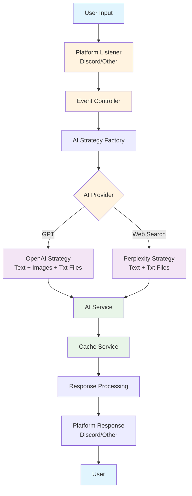

# Bot GPT 🤖

> A sophisticated, event-driven smart bot powered by multiple AI providers with a modular, extensible architecture. Currently supports Discord integration with plans for additional platforms.

[](https://www.typescriptlang.org/)
[](https://nodejs.org/)
[](LICENSE)

## ✨ Features

- 🤖 **Multi-AI Support**: OpenAI GPT and Perplexity AI integration
- 📁 **File Processing**: Support for text files and image attachments
- ⚡ **Real-time**: Live interaction with loading animations
- 🔌 **Platform Agnostic**: Modular design supports multiple platforms (Discord, Express API)
- 🌐 **REST API**: Express server
- 🔐 **Secure Authentication**: API key and skill ID validation
- 📱 **Multi-platform**: Discord bot + HTTP API for external integrations

## 🏗️ Architecture

This project is built with a **modular, event-driven architecture** that makes it easy to add new AI providers, platforms, and features.

### How It Works



### Core Components

```
src/
├── events/             # Event-driven architecture (Observer Pattern)
│   ├── listeners/      # Event listeners (routing layer)
│   │   ├── discord.ts  # Discord event listeners
│   │   └── openai.ts   # AI event listeners
│   └── controllers/    # Business logic controllers
│       ├── discord.ts  # Discord interaction logic
│       ├── openai.ts   # AI processing logic
│       └── helpers/    # Controller utilities
├── strategies/         # AI provider strategies (Strategy Pattern)
│   ├── openai/         # OpenAI GPT implementation
│   ├── perplexity/     # Perplexity AI implementation
│   └── ai-strategy.ts  # Common strategy interface
├── services/           # Core services (Singleton Pattern)
│   ├── ai-services/    # AI provider services
│   ├── discord.ts      # Discord client service
│   ├── express.ts      # Express HTTP server service
│   ├── cache.ts        # Caching service
│   ├── event-emitter.ts # Event emitter service
│   └── logger.ts       # Logging service
├── routes/             # Express API routes
│   └── index.ts        # API endpoints (Alexa, reminders)
└── config/             # Configuration and constants
```

## 🚀 Quick Start

### Prerequisites

- Node.js 18+
- Platform-specific credentials:
  - Discord Bot Token (for Discord integration)
  - Amazon Alexa Skill ID (for Alexa integration)
  - API Key (for express API processing)
- AI Provider Keys:
  - OpenAI API Key (for GPT)
  - Perplexity API Key (for web search)

### Running the Bot

```bash
# Development mode with hot reload
npm run dev

# Production build
npm run build
npm start

# Linting
npm run lint
npm run lint:fix
```

## 🎮 Usage

### Discord Integration

Currently, the bot is implemented with Discord integration. Commands must be registered via their [Commands API](https://discord.com/developers/docs/interactions/application-commands#registering-a-command)

#### `/gpt <message>` - OpenAI Text & Image Processing

Chat with OpenAI GPT for intelligent text-based conversations. This command supports:

_MCP Servers are only supported for OpenAI models currently_

- **Text Input**: Natural language conversations with context awareness
- **Image Uploads**: Process and analyze images using OpenAI's vision capabilities (Requires using an OpenAI model that supports image processing)
- **Text File Attachments**: Upload `.txt` files to provide additional context
- **Conversation Memory**: Maintains chat history for contextual responses

#### `/gptweb <message>` - Perplexity Web Search

Use Perplexity AI for real-time web search and information retrieval. This command supports:

- **Web Search**: Get current information from the internet with citations
- **Text Input**: Ask questions that require up-to-date information
- **Text File Attachments**: Upload `.txt` files to provide context for web searches
- **Citation Links**: Receive source links for all information provided
- **No Image Support**: This command focuses on text-based web queries

### Express API Integration

The bot also provides a REST API for external integrations

### Key Features

- **Shared Conversation History**: Conversation history is maintained across both commands, so you can freely switch between them while maintaining the context.
- **Smart Caching**: Intelligent conversation history management
- **Real-time Processing**: Live interaction with loading animations
- **Error Handling**: Graceful error recovery and user feedback
- **Multi-modal Support**: Handle text, images, and file attachments seamlessly

## 🙏 Acknowledgments

- [Discord.js](https://discord.js.org/) - Discord API wrapper
- [OpenAI](https://openai.com/) - GPT models
- [Perplexity](https://perplexity.ai/) - Web search AI
- [Node.js](https://nodejs.org/) - Runtime environment
